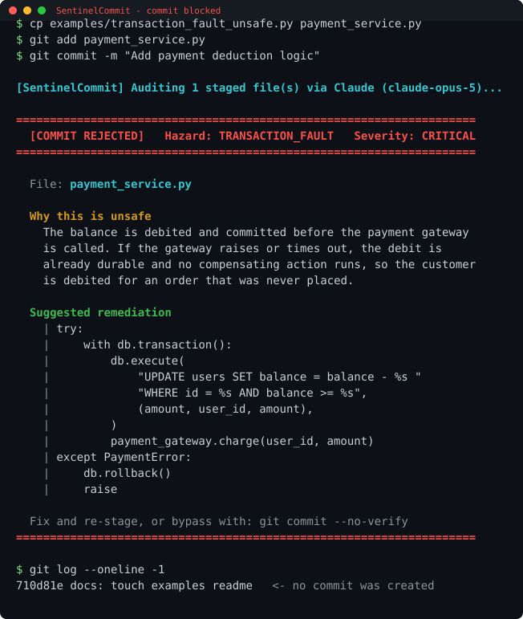
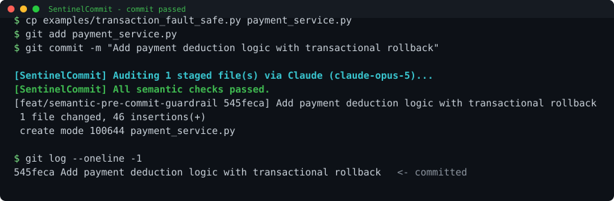

# SentinelCommit

**A Git pre-commit hook that catches semantic bugs your linter structurally cannot.**

Static analysis is very good at the questions it can answer from a syntax tree:
undefined names, wrong types, unreachable branches, unused imports. It is
blind, by construction, to the class of defect that actually takes production
down — a database write made durable before an unguarded network call, a
webhook handler that is not safe to deliver twice, a read-modify-write with a
concurrency window in the middle.

Those bugs pass every linter, every type checker, and usually code review too,
because each individual line is correct. Only the *runtime behaviour* is wrong.

SentinelCommit reads your staged diff on `git commit`, reasons about it with
Claude, and refuses the commit — with a ready-to-paste patch — when it finds
one.

```
====================================================================
  [COMMIT REJECTED]   Hazard: TRANSACTION_FAULT   Severity: CRITICAL
====================================================================

  File: payment_service.py

  Why this is unsafe
    The balance is debited and committed before the payment gateway is
    called. If the gateway raises or times out the debit is already
    durable and no compensating action runs, so the customer is debited
    for an order that was never placed.

  Suggested remediation
    | try:
    |     with db.transaction():
    |         db.execute(
    |             "UPDATE users SET balance = balance - %s "
    |             "WHERE id = %s AND balance >= %s",
    |             (amount, user_id, amount),
    |         )
    |         payment_gateway.charge(user_id, amount)
    | except PaymentError:
    |     db.rollback()
    |     raise

  Fix and re-stage, or bypass with: git commit --no-verify
====================================================================
```

---

## What it detects

Three hazard classes, deliberately. A guardrail that flags everything gets
uninstalled within a day, so the prompt is scoped tightly and instructed to
prefer a false negative over a false positive.

| Hazard | What it means |
| --- | --- |
| `TRANSACTION_FAULT` | A durable write whose operation can fail partway through with no rollback or compensating action, leaving persisted state inconsistent. |
| `IDEMPOTENCY_RISK` | A handler that can legitimately be delivered more than once (webhook, payment capture, queue consumer, retried job) but applies its side effect unconditionally. |
| `RACE_CONDITION` | Unsynchronised access to shared mutable state, or a check-then-act (TOCTOU) window where the checked condition can change before it is acted on. |

Style, naming, formatting, missing tests and performance nits are explicitly
**not** blocking. Your linter already owns those.

Worked unsafe/safe pairs for all three live in [`examples/`](examples/).

---

## How it works

```
git commit
    │
    ├─ Tier 1  Deterministic gate ....................... 0 tokens
    │          empty diff? docs/config only? lockfile only?
    │          └─ yes ─> exit 0, no API call
    │
    ├─ Tier 2  Semantic gate ............................ 1 API call
    │          git diff --cached  ->  Claude (adaptive thinking)
    │          └─ structured output, JSON-schema constrained
    │
    └─ Verdict
               should_block = false ─> exit 0, commit proceeds
               should_block = true  ─> exit 1, commit refused + patch printed
               any error / timeout  ─> exit 0, warn (fail open)
```

Three properties worth calling out:

**Tier 1 is free.** A README tweak, a lockfile bump or a config change never
reaches the API. Token spend tracks actual code changes, not commit count.

**The verdict is schema-constrained, not parsed out of prose.** The request
uses `output_config.format` with a JSON Schema, so the response is guaranteed
to be valid JSON matching the verdict shape. There is no regex, no
`"BLOCK" in response`, and no brittle text parsing anywhere in the decision
path.

**It fails open, always.** Missing API key, dead Wi-Fi, timeout, rate limit,
malformed response — every failure path exits `0` with a warning. A guardrail
that blocks your commit because *its own* dependency is down is worse than no
guardrail. Blocking is reserved for the one case where the model actively
asserts a hazard.

---

## See it work

The same function, committed twice. The only difference is whether the durable
write and the network call share an atomic outcome.

### With the bug — the commit is refused

The balance is debited and **committed**, and only then is the payment gateway
called. Nothing reverses the debit if that call fails:

```python
def process_order(db, payment_gateway, user_id, amount):
    db.execute(
        "UPDATE users SET balance = balance - %s WHERE id = %s",
        (amount, user_id),
    )
    db.commit()                                   # durable, and irreversible

    payment_gateway.charge(user_id, amount)       # if this raises, money is gone
```

`ruff`, `flake8`, `mypy` and `pylint` all pass this file. SentinelCommit does
not:



No commit is created, and the terminal already contains the patch.

### Without the bug — the commit goes through

One transaction now covers the debit, the order row and the gateway call, so a
gateway failure rolls the debit back instead of stranding it:

```python
def process_order(db, payment_gateway, user_id, amount):
    try:
        with db.transaction():
            rows = db.execute(
                "UPDATE users SET balance = balance - %s "
                "WHERE id = %s AND balance >= %s",
                (amount, user_id, amount),
            ).rowcount
            if rows == 0:
                raise InsufficientFunds(user_id)

            payment_gateway.charge(user_id, amount)
    except Exception:
        db.rollback()
        raise
```



Both files are in [`examples/`](examples/) and are byte-for-byte what produced
the output above. The verbatim transcript — plus the two real bugs this testing
caught in the tool itself — is in [`docs/DEMO.md`](docs/DEMO.md). The images are
generated from that transcript by
[`docs/render_demo_svg.py`](docs/render_demo_svg.py).

---

## Install

Requires Python 3.10+ and Git 2.30+.

```bash
git clone https://github.com/Dripar/SentinelCommit.git
cd SentinelCommit
pip install -r requirements.txt
export ANTHROPIC_API_KEY="sk-ant-..."
```

Install the hook into **this** repository:

```bash
./install.sh
```

Install it into a **different** repository:

```bash
cd /path/to/your/project
/path/to/SentinelCommit/install.sh
```

The installer copies `hooks/pre-commit` into the target repo's hooks directory
and refuses to overwrite a pre-commit hook it did not write.

> **Windows:** run the installer from Git Bash. The hook itself is POSIX `sh`,
> which Git for Windows executes with its bundled shell, so it works from
> PowerShell, CMD and GUI Git clients too.

---

## Using it day to day

Once installed there is nothing to run and nothing to remember. You commit as
you always have, and the hook decides whether to get involved.

```bash
git add payment_service.py
git commit -m "Add order payment flow"
```

What happens next depends on what you staged:

| What you staged | What the tool does | Cost | Commit |
| --- | --- | --- | --- |
| Nothing | Exits immediately | free | git's own "nothing to commit" |
| Only docs, config, images, lockfiles | Tier 1 skips it, no API call | free | proceeds |
| Code with no hazard found | Tier 2 audits, prints one green line | 1 call | proceeds |
| Code with a `HIGH`/`CRITICAL` hazard | Tier 2 prints the banner and patch | 1 call | **refused** |
| Anything, but the API is unreachable | Prints a warning | free | proceeds (fail open) |

### When it blocks you

Read the reason, then pick one:

```bash
# 1. It is right. Apply the printed patch, re-stage, commit again.
git add payment_service.py && git commit -m "Add order payment flow"

# 2. It is wrong, or you are mid-spike and do not care yet.
git commit --no-verify -m "WIP: spike, not production path"
```

`--no-verify` is a supported answer, not a defeat. The tool is tuned to block
rarely; if it blocks often on your codebase, that is a bug in the prompt, not
a reason to fight the hook.

### Checking before you commit

Run the audit by hand against whatever is staged — useful mid-change, or to
see what the hook *would* say:

```bash
git add -A
python sentinel.py; echo "exit=$?"     # 0 = would allow, 1 = would block
```

### Trying it without spending anything

`SENTINEL_MOCK=1` returns a cached verdict with no network call, so you can
learn the workflow, rehearse a demo, or work on a plane:

```bash
SENTINEL_MOCK=1 git commit -m "Add order payment flow"
```

### Rolling it out to a team

The hook lives in `.git/hooks/`, which Git does not clone. Each developer runs
`install.sh` once. To make that automatic, point the repo at a tracked hooks
directory instead:

```bash
git config core.hooksPath hooks     # committed, so everyone gets it on clone
```

Two things worth agreeing on before you do:
- Everyone needs `ANTHROPIC_API_KEY` set, or the hook silently fails open and
  audits nothing.
- It adds a few seconds to commits that touch code. Teams that commit in very
  small increments feel this more than teams that don't.

### Using it in CI instead of locally

The engine is just a script with an exit code, so the same check works as a PR
gate. Diff against the base branch rather than the index:

```bash
git diff origin/main...HEAD > /tmp/pr.diff
# stage the PR's changes, then:
python sentinel.py
```

Note that in CI the fail-open behaviour is usually wrong — a missing key there
means the gate silently passes everything. Assert the key is present before
invoking it.

---

## Live demo

Two scenarios, roughly sixty seconds. Works offline with `SENTINEL_MOCK=1`.

**Scenario A — the commit is refused**

```bash
cp examples/transaction_fault_unsafe.py payment_service.py
git add payment_service.py
git commit -m "Add payment deduction logic"
```

The hook prints a red `[COMMIT REJECTED]` banner naming the hazard, explains
the exact failure sequence, prints a remediation patch, and exits non-zero.
No commit is created.

**Scenario B — the remediated commit passes**

```bash
git reset                                      # clear scenario A from the index
cp examples/transaction_fault_safe.py payment_service.py
git add payment_service.py
git commit -m "Add payment deduction logic with transactional rollback"
```

The hook prints a green `[SentinelCommit] All semantic checks passed.` and the
commit is created.

> `git add` stages, it does not *un*stage. The `git reset` between scenarios
> matters — without it the unsafe file is still in the index and the second
> commit is blocked too.

---

## Configuration

Every setting is an environment variable, so it can be set per-shell,
per-repository or in CI without editing code.

| Variable | Default | Purpose |
| --- | --- | --- |
| `ANTHROPIC_API_KEY` | — | API credentials. Unset ⇒ the hook fails open. |
| `SENTINEL_MOCK` | unset | `1` returns a cached verdict with no network call. For demos and offline work. |
| `SENTINEL_MODEL` | `claude-opus-5` | Model id. |
| `SENTINEL_EFFORT` | `medium` | `low` \| `medium` \| `high` \| `xhigh` \| `max`. Higher catches more subtle defects, costs more latency. |
| `SENTINEL_TIMEOUT` | `45` | Per-request timeout, seconds. On timeout the hook fails open. |
| `SENTINEL_MAX_DIFF` | `60000` | Diff characters sent before truncation. |
| `SENTINEL_FORCE_COLOR` | unset | `1` forces ANSI colour when stdout is not a TTY. |
| `NO_COLOR` | unset | Standard opt-out; disables all colour. |

---

## Design notes

**Why a pre-commit hook and not CI?** The feedback has to arrive while the
change is still in your working memory. A CI failure fifteen minutes later
costs a context switch; a rejected `git commit` costs four seconds. And a
commit that never existed needs no revert.

**Why fail open?** A guardrail is adopted only if it is never the reason work
stops. The cost asymmetry is stark: a missed detection leaves you exactly where
you were without the tool, while a false block on a flaky network trains the
whole team to run `--no-verify` reflexively — which disables the tool
permanently. Every ambiguous path therefore resolves to "allow".

**Why only three hazard classes?** Precision is the product. A tool that
comments on naming conventions gets muted; a tool that has only ever stopped
real outages gets trusted. The system prompt names the three classes
explicitly, requires `HIGH` or `CRITICAL` severity to block, and instructs the
model not to block when uncertain.

**Why structured outputs rather than a forced tool call?** Both constrain the
shape of the response. Structured outputs compose cleanly with adaptive
thinking, which materially helps on exactly this task — reasoning about failure
interleavings is where the extra thinking budget pays for itself.

### Known limitations

- **Single-diff context.** The model sees the staged diff, not the whole
  repository. A hazard that exists only in the interaction between the diff and
  an unmodified file elsewhere will be missed.
- **Non-determinism.** The same diff can occasionally produce a different
  verdict. This is a guardrail, not a proof; treat a pass as "nothing obvious
  found", not as a correctness guarantee.
- **Latency.** Roughly 3–10s per commit that reaches Tier 2, depending on
  `SENTINEL_EFFORT` and diff size. Tier 1 commits are instant.
- **Cost.** One API call per code-bearing commit. Docs-only commits are free.

---

## Repository layout

```
sentinel.py             Core engine: diff extraction, both gates, reporting
hooks/pre-commit        POSIX sh wrapper; resolves repo root and interpreter
install.sh              Idempotent hook installer
examples/               Unsafe/safe pairs, one per hazard class
requirements.txt        anthropic (+ colorama on Windows)
```

---

## Event

Built at **Claude Build Day**, Webkul, Noida.
Track: Everyday Developer Tooling / Breakthrough.
Model: `claude-opus-5` with adaptive extended thinking.

## Licence

MIT — see [LICENSE](LICENSE).
